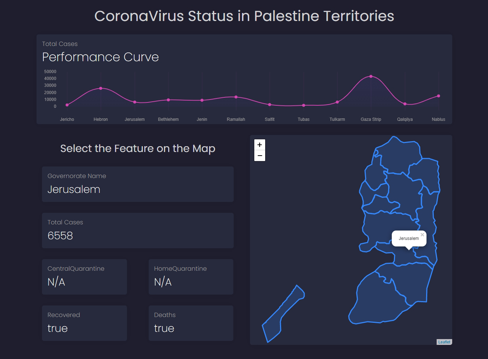

# CoronaVirus Status in Palestine Territories
#### the pandemic in all places for so sorry, according to it I had developed coronavirus status dashboard that increasing daily Frighteningly, that it was a good chance for workout my first trial increate dashboards with JavaScript.
#### I think as a first try it's very good, but I was it wish it on another topic not coronavirus🙃,but it's ok let's talk more about my dashbpard

## Dashboard Features
- getting daily updates automatically once the update in the server
- the dashboard is a Responsive design in which can be viewed using many different devices
- clicking over the feature shows the Name governorate as a popup and show more governorate corona virus data's in the Neighboring boxes

## Summary
#### I have designed and built a dashboard using `Bootstrap` , `Leaflet.js` (the map creator), `Chart.js` and `JS AJAX` (to read data from a web server).
\

## for see it 
[CoronaVirus Status](https://coronavirusinps.netlify.app)
